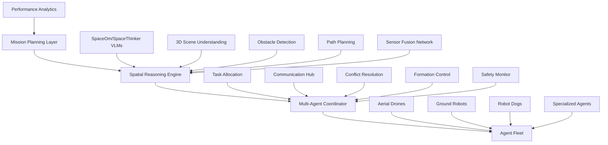

# Heterogeneous Multi-Agent Navigation System 🤖🚁🐕

**Next Steps Guide: From Spatial Reasoning to Autonomous Heterogeneous Navigation**

Advanced navigation system development for coordinated multi-agent systems including drones, mobile robots, robot dogs, and swarm coordination using spatial VLM capabilities.

## Table of Contents
- [Vision & Objectives](#vision--objectives)
- [System Architecture](#system-architecture)
- [Agent Types & Capabilities](#agent-types--capabilities)
- [Development Roadmap](#development-roadmap)
- [Technical Implementation](#technical-implementation)
- [Integration Framework](#integration-framework)
- [Swarm Coordination](#swarm-coordination)
- [Safety & Reliability](#safety--reliability)
- [Performance Metrics](#performance-metrics)
- [Deployment Scenarios](#deployment-scenarios)

## Vision & Objectives

### 🎯 **Mission Statement**
Develop an autonomous heterogeneous navigation system that enables coordinated operation of diverse robotic agents using advanced spatial reasoning for complex real-world missions.

### **Core Objectives**
1. **Multi-Agent Coordination**: Seamless collaboration between different robot types
2. **Spatial Intelligence**: Leverage VLM-based spatial reasoning for navigation decisions
3. **Dynamic Adaptation**: Real-time path planning and obstacle avoidance
4. **Mission Optimization**: Efficient task allocation and resource utilization
5. **Fault Tolerance**: Robust operation with agent failures and communication loss
6. **Scalability**: Support for swarms of 2-100+ agents

### **Target Applications**
- 🏭 **Industrial Inspection**: Multi-level facility monitoring
- 🔍 **Search & Rescue**: Coordinated emergency response
- 🚛 **Logistics & Delivery**: Warehouse to door coordination  
- 🛡️ **Security & Surveillance**: Perimeter and area monitoring
- 🌾 **Agriculture**: Crop monitoring and management
- 🏗️ **Construction**: Site monitoring and progress tracking

## System Architecture



### **System Layers**

#### 1. **Mission Planning Layer** 🎯
- High-level objective definition
- Area decomposition and task assignment
- Resource allocation optimization
- Mission timeline management

#### 2. **Spatial Reasoning Engine** 🧠
- Multi-modal spatial analysis using SpaceOm/SpaceThinker
- Real-time 3D scene reconstruction
- Obstacle detection and classification
- Dynamic path planning with spatial constraints

#### 3. **Multi-Agent Coordinator** 🕸️
- Inter-agent communication protocol
- Formation control and collision avoidance  
- Task distribution and load balancing
- Coordination strategy adaptation

#### 4. **Agent Fleet** 🤖
- Heterogeneous robot management
- Individual agent control systems
- Sensor data collection and sharing
- Action execution and feedback

## Agent Types & Capabilities

### 🚁 **Aerial Drones (UAVs)**

**Platform Examples:**
- DJI Matrice series, Autel EVO series, Custom quadcopters
- Fixed-wing drones for long-range missions

**Capabilities:**
- **Mobility**: 3D movement, hovering, vertical take-off/landing
- **Sensors**: RGB cameras, thermal imaging, LiDAR, IMU, GPS
- **Payload**: 0.5-5kg depending on platform
- **Endurance**: 15-60 minutes flight time
- **Range**: 1-15km operational radius

**Spatial Reasoning Applications:**
```python
# Drone-specific spatial queries
queries = [
    "What's the clearance height for safe navigation?",
    "Are there any aerial obstacles (wires, poles)?", 
    "What's the optimal landing zone in this area?",
    "Distance to nearest obstacle in flight path?",
    "Wind corridor analysis for safe passage?"
]
```

**Navigation Specializations:**
- Overhead surveillance and mapping
- Vertical inspection of structures
- Long-range reconnaissance  
- Emergency supply delivery
- Swarm formation flying

### 🚗 **Ground Mobile Robots**

**Platform Examples:**
- TurtleBot series, Jackal UGV, Husky UGV
- Custom wheeled/tracked platforms

**Capabilities:**
- **Mobility**: 2D ground movement, climbing capabilities
- **Sensors**: 360° LiDAR, stereo cameras, ultrasonic, encoders  
- **Payload**: 5-100kg depending on platform
- **Endurance**: 2-8 hours operation time
- **Range**: Indoor/outdoor operation up to 5km

**Spatial Reasoning Applications:**
```python
# Ground robot spatial queries  
queries = [
    "What's the ground clearance needed for this terrain?",
    "Are there stairs or elevation changes ahead?",
    "Width of the narrowest passage in this corridor?", 
    "Surface material classification for traction?",
    "Optimal path avoiding pedestrian areas?"
]
```

**Navigation Specializations:**
- Indoor facility navigation
- Perimeter patrol and monitoring
- Heavy payload transport
- Detailed ground-level inspection
- Security and access control

### 🐕 **Quadruped Robots (Robot Dogs)**

**Platform Examples:**
- Boston Dynamics Spot, Unitree Go1/A1, ANYmal

**Capabilities:**
- **Mobility**: Dynamic walking, climbing stairs, rough terrain
- **Sensors**: RGB-D cameras, LiDAR, IMU, force sensors
- **Payload**: 5-20kg with manipulation arms
- **Endurance**: 1-3 hours continuous operation  
- **Range**: All-terrain capability, indoor/outdoor

**Spatial Reasoning Applications:**
```python
# Quadruped spatial queries
queries = [
    "Can this robot navigate stairs of this height?", 
    "What's the stability margin on this slope?",
    "Are there obstacles that require crawling under?",
    "Optimal foothold placement on uneven terrain?",
    "Door width sufficient for passage?"
]
```

**Navigation Specializations:**
- Complex terrain traversal
- Indoor/outdoor facility inspection  
- Human-robot collaboration in tight spaces
- Manipulation tasks requiring mobility
- Emergency response in hazardous areas

### 🛠️ **Specialized Agents**

**Marine/Amphibious Robots:**
- Underwater inspection, surface monitoring
- Shore-to-water transition capabilities

**Climbing Robots:**
- Vertical structure inspection
- Building facade and tower maintenance  

**Micro/Nano Drones:**
- Indoor swarm applications
- Confined space exploration

## Development Roadmap

### **Phase 1: Foundation (Months 1-3)** 🏗️

#### **Objectives:**
- Establish core spatial reasoning integration
- Develop single-agent navigation systems
- Create communication protocols

#### **Key Deliverables:**

1. **Enhanced Spatial VLM Integration**
```python
# Advanced spatial reasoning for navigation
class NavigationSpatialReasoner:
    def __init__(self):
        self.spatial_model = SpatialModelSelector()
        self.path_planner = PathPlanningModule()
        self.obstacle_detector = ObstacleDetection()
        
    def analyze_navigation_scene(self, sensor_data, agent_type):
        """Agent-specific spatial analysis"""
        if agent_type == "drone":
            return self.analyze_aerial_scene(sensor_data)
        elif agent_type == "ground_robot":
            return self.analyze_ground_scene(sensor_data)
        elif agent_type == "robot_dog":
            return self.analyze_terrain_scene(sensor_data)
```

2. **Agent Abstraction Layer**
```python
class BaseAgent:
    def __init__(self, agent_id, agent_type, capabilities):
        self.id = agent_id
        self.type = agent_type
        self.capabilities = capabilities
        self.spatial_reasoner = NavigationSpatialReasoner()
        
    def navigate_to_waypoint(self, target_position):
        """Universal navigation interface"""
        pass
        
    def avoid_obstacles(self, obstacle_data):
        """Agent-specific obstacle avoidance"""
        pass
```

3. **Communication Framework**
```python
class MultiAgentCommunication:
    def __init__(self):
        self.ros_master = rospy.init_node('multi_agent_coordinator')
        self.agent_registry = {}
        
    def register_agent(self, agent):
        """Add agent to coordination network"""
        pass
        
    def broadcast_spatial_data(self, sensor_data, source_agent):
        """Share spatial information across fleet"""
        pass
```

#### **Technical Tasks:**
- [ ] Integrate SpaceOm/SpaceThinker with ROS navigation stack
- [ ] Develop agent-specific spatial query templates  
- [ ] Implement basic multi-agent communication protocol
- [ ] Create simulation environment with Gazebo/AirSim
- [ ] Test single-agent navigation with spatial reasoning

### **Phase 2: Multi-Agent Coordination (Months 4-6)** 🤝

#### **Objectives:**
- Implement coordinated navigation between 2-5 agents
- Develop task allocation and formation control
- Integrate sensor fusion across agents

#### **Key Deliverables:**

1. **Coordination Algorithms**
```python
class FleetCoordinator:
    def __init__(self):
        self.agents = {}
        self.mission_planner = MissionPlanner()
        self.formation_controller = FormationController()
        
    def allocate_tasks(self, mission_objectives, agent_capabilities):
        """Optimize task assignment based on agent strengths"""
        task_assignments = {}
        
        for task in mission_objectives:
            best_agent = self.select_optimal_agent(task, agent_capabilities)
            task_assignments[task.id] = best_agent.id
            
        return task_assignments
        
    def coordinate_movements(self, agent_positions, target_formation):
        """Maintain formation while avoiding collisions"""
        movement_commands = self.formation_controller.compute_commands(
            agent_positions, target_formation
        )
        return movement_commands
```

2. **Sensor Fusion Network**
```python
class DistributedSensorFusion:
    def __init__(self):
        self.sensor_data_buffer = {}
        self.spatial_map = OccupancyGrid3D()
        
    def fuse_multi_agent_sensors(self, agent_sensor_data):
        """Combine sensor data from multiple agents"""
        fused_map = self.spatial_map
        
        for agent_id, sensor_data in agent_sensor_data.items():
            # Transform sensor data to global coordinate frame
            global_sensor_data = self.transform_to_global(sensor_data, agent_id)
            
            # Update global spatial map
            fused_map.update(global_sensor_data)
            
        return fused_map
```

3. **Dynamic Task Reallocation**
```python
class AdaptiveTaskManager:
    def monitor_agent_status(self):
        """Continuously monitor agent health and performance"""
        for agent in self.active_agents:
            if agent.battery_low() or agent.communication_lost():
                self.redistribute_tasks(agent.current_tasks)
                
    def redistribute_tasks(self, failed_tasks):
        """Reassign tasks when agents fail or become unavailable"""
        available_agents = self.get_available_agents()
        for task in failed_tasks:
            backup_agent = self.find_backup_agent(task, available_agents)
            if backup_agent:
                self.assign_task(task, backup_agent)
```

#### **Technical Tasks:**
- [ ] Develop distributed SLAM for multi-agent mapping
- [ ] Implement formation control algorithms (leader-follower, consensus)
- [ ] Create task allocation optimization (Hungarian algorithm, auction-based)
- [ ] Build real-time communication system (ROS2 DDS, custom protocols)
- [ ] Test coordination scenarios with simulated heterogeneous agents

### **Phase 3: Swarm Intelligence (Months 7-9)** 🐝

#### **Objectives:**  
- Scale to 10-50 agent coordination
- Implement emergent behavior algorithms
- Develop swarm-specific spatial reasoning

#### **Key Deliverables:**

1. **Swarm Coordination Engine**
```python
class SwarmCoordinator:
    def __init__(self, max_agents=50):
        self.max_agents = max_agents
        self.swarm_behavior = SwarmBehaviorEngine()
        self.emergent_patterns = EmergentPatternDetector()
        
    def coordinate_swarm_movement(self, swarm_state, objective):
        """Coordinate large-scale swarm movements"""
        # Implement boids-like flocking behavior
        separation = self.compute_separation_forces(swarm_state)
        alignment = self.compute_alignment_forces(swarm_state)  
        cohesion = self.compute_cohesion_forces(swarm_state)
        
        # Add objective-driven forces
        objective_force = self.compute_objective_force(objective)
        
        # Combine forces for each agent
        swarm_commands = separation + alignment + cohesion + objective_force
        return swarm_commands
```

2. **Distributed Spatial Reasoning**
```python
class SwarmSpatialIntelligence:
    def __init__(self):
        self.collective_memory = CollectiveSpatialMemory()
        self.pattern_recognition = SwarmPatternRecognition()
        
    def collective_spatial_analysis(self, distributed_observations):
        """Analyze spatial information across entire swarm"""
        # Each agent contributes local spatial observations
        local_analyses = []
        for agent_id, observation in distributed_observations.items():
            local_analysis = self.analyze_local_space(observation)
            local_analyses.append(local_analysis)
            
        # Merge into collective spatial understanding
        global_spatial_map = self.merge_spatial_analyses(local_analyses)
        
        # Detect emergent spatial patterns
        spatial_patterns = self.pattern_recognition.detect_patterns(global_spatial_map)
        
        return global_spatial_map, spatial_patterns
```

3. **Emergent Behavior Engine**
```python
class EmergentBehaviorEngine:
    def __init__(self):
        self.behavior_rules = SwarmBehaviorRules()
        self.adaptation_engine = BehaviorAdaptation()
        
    def evolve_swarm_behavior(self, performance_metrics, environmental_feedback):
        """Adapt swarm behavior based on performance"""
        if performance_metrics.efficiency < threshold:
            new_behaviors = self.adaptation_engine.generate_behaviors(
                current_rules=self.behavior_rules,
                feedback=environmental_feedback
            )
            self.behavior_rules.update(new_behaviors)
```

#### **Technical Tasks:**
- [ ] Implement scalable communication protocols (hierarchical, gossip-based)
- [ ] Develop emergent behavior algorithms (flocking, stigmergy, consensus)
- [ ] Create distributed spatial mapping and sharing
- [ ] Build performance optimization for large swarms
- [ ] Test swarm scenarios with 20+ simulated agents

### **Phase 4: Real-World Integration (Months 10-12)** 🌍

#### **Objectives:**
- Deploy on physical robot platforms  
- Integrate with existing robotic systems
- Validate in real operational scenarios

#### **Key Deliverables:**

1. **Hardware Integration**
```python
# Platform-specific drivers and interfaces
class DroneInterface(BaseAgent):
    def __init__(self, mavlink_connection):
        super().__init__(agent_type="drone")
        self.mavlink = mavlink_connection
        self.flight_controller = FlightController(mavlink)
        
    def navigate_to_waypoint(self, waypoint):
        """Navigate drone to 3D waypoint"""
        self.flight_controller.goto_position_target_local_ned(
            waypoint.x, waypoint.y, waypoint.z
        )
        
class RobotDogInterface(BaseAgent):
    def __init__(self, spot_sdk_robot):
        super().__init__(agent_type="robot_dog")  
        self.robot = spot_sdk_robot
        self.mobility_params = MobilityParams()
        
    def navigate_to_waypoint(self, waypoint):
        """Navigate robot dog to 2D waypoint"""
        self.robot.move_to_position(waypoint.x, waypoint.y, waypoint.heading)
```

2. **System Integration Framework**
```python
class HeterogeneousNavigationSystem:
    def __init__(self):
        self.agent_factory = AgentFactory()
        self.mission_executor = MissionExecutor()  
        self.safety_monitor = SafetyMonitor()
        
    def deploy_mission(self, mission_config):
        """Deploy complete heterogeneous mission"""
        # Initialize agent fleet based on mission requirements
        agents = self.agent_factory.create_fleet(mission_config.required_agents)
        
        # Execute coordinated mission
        mission_result = self.mission_executor.execute(
            mission=mission_config,
            agent_fleet=agents,
            safety_constraints=self.safety_monitor.get_constraints()
        )
        
        return mission_result
```

3. **Performance Validation**
```python
class PerformanceValidator:
    def __init__(self):
        self.metrics_collector = MetricsCollector()
        self.benchmark_suite = NavigationBenchmarks()
        
    def validate_navigation_performance(self, test_scenarios):
        """Validate system performance across scenarios"""
        results = {}
        
        for scenario in test_scenarios:
            scenario_results = self.benchmark_suite.run_scenario(
                scenario=scenario,
                navigation_system=self.navigation_system
            )
            results[scenario.name] = scenario_results
            
        return self.analyze_performance_results(results)
```

## Technical Implementation

### **Core Technologies Stack**

#### **Robotics Framework**
```yaml
# ROS2 Configuration
ros_distro: humble  # or iron, rolling
middleware: FastDDS  # or Cyclone DDS
communication: 
  - topic_based: sensor data, status updates
  - service_based: mission commands, coordination requests  
  - action_based: navigation goals, complex tasks

# Key ROS2 Packages
packages:
  - nav2_stack: Navigation framework
  - tf2: Coordinate transformations  
  - sensor_msgs: Sensor data interfaces
  - geometry_msgs: Position and movement data
  - diagnostic_msgs: System health monitoring
```

#### **Spatial Reasoning Integration**
```python
# ROS2 + Spatial VLM Integration
class SpatialReasoningNode(Node):
    def __init__(self):
        super().__init__('spatial_reasoning_node')
        
        # Initialize spatial models
        self.spatial_models = SpatialModelSelector()
        self.spatial_models.load_available_models()
        
        # ROS2 interfaces
        self.image_subscriber = self.create_subscription(
            Image, '/camera/image_raw', self.image_callback, 10
        )
        
        self.spatial_analysis_service = self.create_service(
            SpatialQuery, 'analyze_spatial_scene', self.analyze_scene_callback
        )
        
    def analyze_scene_callback(self, request, response):
        """Service to analyze spatial scenes for navigation"""
        result = self.spatial_models.ask_spatial_question(
            images=[request.image],
            question=request.spatial_query,
            model_choice="SpaceThinker"  # Use most accurate for navigation
        )
        
        response.spatial_analysis = result
        response.confidence_score = self.compute_confidence(result)
        return response
```

#### **Multi-Agent Communication**
```python
# Distributed Communication System  
class MultiAgentComm(Node):
    def __init__(self, agent_id):
        super().__init__(f'agent_comm_{agent_id}')
        self.agent_id = agent_id
        
        # Publish agent status
        self.status_publisher = self.create_publisher(
            AgentStatus, f'/agents/{agent_id}/status', 10
        )
        
        # Subscribe to fleet coordination
        self.fleet_subscriber = self.create_subscription(
            FleetCommand, '/fleet/commands', self.fleet_command_callback, 10
        )
        
        # Spatial data sharing
        self.spatial_data_publisher = self.create_publisher(
            SpatialData, f'/agents/{agent_id}/spatial_data', 10  
        )
        
    def share_spatial_observation(self, sensor_data, spatial_analysis):
        """Share spatial observations with fleet"""
        spatial_msg = SpatialData()
        spatial_msg.agent_id = self.agent_id
        spatial_msg.timestamp = self.get_clock().now().to_msg()
        spatial_msg.sensor_data = sensor_data
        spatial_msg.spatial_analysis = spatial_analysis
        
        self.spatial_data_publisher.publish(spatial_msg)
```

### **Simulation Environment**

#### **Gazebo Integration**
```python
# Multi-Agent Simulation World
class HeterogeneousSimulation:
    def __init__(self):
        self.world_file = "heterogeneous_navigation_world.sdf"
        self.agent_spawner = AgentSpawner()
        
    def setup_simulation_world(self):
        """Create complex simulation environment"""
        # Multi-level environment (ground + aerial space)
        world_config = {
            'ground_level': {
                'obstacles': ['buildings', 'vehicles', 'pedestrians'],
                'terrain': ['flat', 'stairs', 'ramps', 'rough_terrain']
            },
            'aerial_level': {
                'obstacles': ['power_lines', 'trees', 'buildings'],  
                'wind_conditions': 'variable',
                'no_fly_zones': ['airports', 'restricted_areas']
            }
        }
        
        self.generate_world(world_config)
        
    def spawn_heterogeneous_fleet(self, fleet_config):
        """Spawn diverse agent types in simulation"""
        for agent_config in fleet_config:
            agent = self.agent_spawner.spawn_agent(
                agent_type=agent_config.type,
                initial_position=agent_config.spawn_position,
                sensor_suite=agent_config.sensors
            )
            
        return self.agent_spawner.get_spawned_agents()
```

#### **AirSim Integration** 
```python
# Aerial-focused simulation with AirSim
class AirSimMultiAgent:
    def __init__(self):
        self.airsim_client = airsim.MultirotorClient()
        self.active_drones = {}
        
    def setup_drone_fleet(self, drone_configs):
        """Initialize multiple drones in AirSim"""
        for config in drone_configs:
            drone_name = config.name
            
            # Enable API control
            self.airsim_client.enableApiControl(True, drone_name)
            self.airsim_client.armDisarm(True, drone_name)
            
            # Configure sensors
            self.configure_drone_sensors(drone_name, config.sensors)
            
            self.active_drones[drone_name] = config
            
    def coordinate_drone_movements(self, flight_plan):
        """Execute coordinated flight patterns"""
        for drone_name, waypoints in flight_plan.items():
            # Async flight for coordinated movement
            self.airsim_client.moveOnPathAsync(
                waypoints, 5.0, vehicle_name=drone_name
            )
```

### **Safety & Fault Tolerance**

#### **Safety Monitoring System**
```python
class SafetyMonitor:
    def __init__(self):
        self.safety_constraints = SafetyConstraints()
        self.emergency_protocols = EmergencyProtocols()
        self.risk_assessor = RiskAssessment()
        
    def monitor_fleet_safety(self, fleet_state):
        """Continuously monitor safety conditions"""
        safety_violations = []
        
        for agent in fleet_state.agents:
            # Check spatial safety constraints
            spatial_risks = self.assess_spatial_risks(agent)
            
            # Check system health
            system_health = self.check_system_health(agent)
            
            # Check mission parameters  
            mission_compliance = self.check_mission_compliance(agent)
            
            if spatial_risks.level > SafetyLevel.ACCEPTABLE:
                safety_violations.append(
                    SafetyViolation(agent.id, 'spatial_risk', spatial_risks)
                )
                
        return safety_violations
        
    def execute_emergency_protocol(self, emergency_type, affected_agents):
        """Execute appropriate emergency response"""
        if emergency_type == 'collision_imminent':
            self.emergency_protocols.execute_collision_avoidance(affected_agents)
        elif emergency_type == 'communication_loss':
            self.emergency_protocols.execute_fallback_behavior(affected_agents)  
        elif emergency_type == 'system_failure':
            self.emergency_protocols.execute_safe_landing(affected_agents)
```

#### **Fault Recovery System**
```python
class FaultRecoverySystem:
    def __init__(self):
        self.fault_detector = FaultDetector()
        self.recovery_strategies = RecoveryStrategies()
        
    def handle_agent_failure(self, failed_agent, failure_type):
        """Implement fault recovery strategies"""
        
        if failure_type == 'sensor_failure':
            # Switch to backup sensors or rely on other agents
            backup_strategy = self.recovery_strategies.get_sensor_backup(failed_agent)
            return backup_strategy
            
        elif failure_type == 'communication_failure':
            # Implement autonomous behavior until reconnection
            autonomous_behavior = self.recovery_strategies.get_autonomous_mode(failed_agent)
            return autonomous_behavior
            
        elif failure_type == 'navigation_failure':
            # Emergency stop and request human intervention
            emergency_stop = self.recovery_strategies.get_emergency_stop(failed_agent)
            return emergency_stop
```

## Performance Metrics

### **Navigation Performance**
```python
class NavigationMetrics:
    def __init__(self):
        self.metrics = {
            'path_efficiency': PathEfficiencyMetric(),
            'collision_avoidance': CollisionAvoidanceMetric(), 
            'mission_completion': MissionCompletionMetric(),
            'coordination_effectiveness': CoordinationMetric()
        }
        
    def evaluate_navigation_performance(self, mission_data):
        """Comprehensive navigation performance evaluation"""
        results = {}
        
        # Path efficiency (actual vs optimal path length)
        results['path_efficiency'] = self.metrics['path_efficiency'].compute(
            actual_paths=mission_data.agent_trajectories,
            optimal_paths=mission_data.optimal_trajectories  
        )
        
        # Collision avoidance success rate
        results['collision_avoidance'] = self.metrics['collision_avoidance'].compute(
            near_miss_events=mission_data.near_miss_events,
            collision_events=mission_data.collision_events
        )
        
        # Mission completion metrics
        results['mission_completion'] = self.metrics['mission_completion'].compute(
            completed_objectives=mission_data.completed_objectives,
            total_objectives=mission_data.total_objectives,
            completion_time=mission_data.mission_duration
        )
        
        return results
```

### **Coordination Effectiveness**
```python
class CoordinationMetrics:
    def evaluate_swarm_coordination(self, swarm_data):
        """Evaluate multi-agent coordination effectiveness"""
        
        # Formation maintenance
        formation_error = self.compute_formation_error(
            actual_formations=swarm_data.formations,
            target_formations=swarm_data.target_formations
        )
        
        # Communication efficiency  
        comm_efficiency = self.compute_communication_efficiency(
            message_count=swarm_data.message_count,
            successful_transmissions=swarm_data.successful_transmissions,
            mission_duration=swarm_data.duration
        )
        
        # Task allocation optimality
        task_optimality = self.compute_task_allocation_optimality(
            actual_allocation=swarm_data.task_allocation,
            optimal_allocation=swarm_data.optimal_allocation
        )
        
        return {
            'formation_maintenance': formation_error,
            'communication_efficiency': comm_efficiency,
            'task_allocation_optimality': task_optimality
        }
```

## Deployment Scenarios

### **Industrial Inspection** 🏭
```python
class IndustrialInspectionMission:
    def __init__(self, facility_map):
        self.facility = facility_map
        self.inspection_points = self.identify_inspection_points()
        
    def plan_heterogeneous_inspection(self):
        """Plan coordinated inspection using multiple agent types"""
        
        mission_plan = {
            'aerial_drones': {
                'tasks': ['roof_inspection', 'high_structure_inspection', 'overhead_survey'],
                'agents': 3,
                'flight_altitude': 10-50,  # meters
                'equipment': ['thermal_camera', 'high_res_camera', 'LiDAR']
            },
            
            'ground_robots': {
                'tasks': ['ground_level_inspection', 'indoor_facility_check', 'equipment_monitoring'], 
                'agents': 2,
                'navigation_areas': ['production_floor', 'warehouse', 'maintenance_areas'],
                'equipment': ['360_camera', 'gas_sensors', 'sound_monitoring']
            },
            
            'robot_dogs': {
                'tasks': ['stair_inspection', 'confined_space_check', 'multi_level_access'],
                'agents': 1, 
                'access_areas': ['catwalks', 'basement', 'maintenance_tunnels'],
                'equipment': ['articulated_camera', 'manipulation_arm', 'environmental_sensors']
            }
        }
        
        return mission_plan
```

### **Search & Rescue** 🔍
```python
class SearchRescueMission:
    def __init__(self, disaster_area):
        self.search_area = disaster_area
        self.urgency_level = 'HIGH'
        
    def coordinate_search_operation(self):
        """Coordinate multi-agent search and rescue"""
        
        search_strategy = {
            'area_coverage': {
                'aerial_search': {
                    'agents': 'drone_swarm_6_units',
                    'pattern': 'grid_search_pattern',
                    'sensors': ['thermal_imaging', 'optical_zoom', 'audio_detection'],
                    'coverage_altitude': 30  # meters above ground
                },
                
                'ground_search': {
                    'agents': 'mobile_robots_4_units', 
                    'pattern': 'systematic_ground_coverage',
                    'sensors': ['ground_penetrating_radar', 'chemical_detection', 'audio_sensors'],
                    'terrain_capability': 'all_terrain'
                },
                
                'detailed_investigation': {
                    'agents': 'robot_dogs_2_units',
                    'pattern': 'targeted_investigation',
                    'sensors': ['high_resolution_cameras', 'manipulation_tools', 'communication_relay'],
                    'access_capability': 'confined_spaces'
                }
            },
            
            'coordination_protocol': {
                'information_sharing': 'real_time_spatial_data_fusion',
                'task_reallocation': 'dynamic_based_on_findings', 
                'safety_monitoring': 'continuous_risk_assessment'
            }
        }
        
        return search_strategy
```

### **Agricultural Monitoring** 🌾
```python
class PrecisionAgricultureMission:
    def __init__(self, farm_boundaries, crop_types):
        self.farm_area = farm_boundaries
        self.crops = crop_types
        self.monitoring_schedule = MonitoringSchedule()
        
    def plan_crop_monitoring(self):
        """Plan comprehensive crop monitoring operation"""
        
        monitoring_plan = {
            'aerial_surveillance': {
                'drones': 4,
                'coverage_pattern': 'systematic_grid',
                'sensors': ['multispectral_imaging', 'thermal_sensors', 'high_resolution_rgb'],
                'flight_height': 50,  # meters for optimal imaging
                'frequency': 'daily_during_growing_season'
            },
            
            'ground_truth_collection': {
                'mobile_robots': 2,
                'sampling_pattern': 'random_stratified_sampling', 
                'sensors': ['soil_moisture', 'ph_sensors', 'plant_health_imaging'],
                'mobility': 'track_based_for_soft_soil',
                'frequency': 'weekly_ground_validation'
            },
            
            'precision_intervention': {
                'robot_dogs': 1,
                'tasks': ['targeted_plant_inspection', 'localized_treatment_application'],
                'sensors': ['close_range_imaging', 'manipulation_arm', 'treatment_dispensers'],  
                'mobility': 'adaptive_gait_for_crop_rows',
                'activation': 'on_demand_based_on_aerial_findings'
            }
        }
        
        return monitoring_plan
```

## Integration with Existing Systems

### **ROS1/ROS2 Migration**
```bash
# ROS1 to ROS2 bridge for legacy systems
ros2 run ros1_bridge dynamic_bridge --bridge-all-topics

# Custom message conversion for spatial reasoning
ros2 run spatial_reasoning_bridge spatial_msg_converter \
    --input-topic /legacy/spatial_data \
    --output-topic /spatial_reasoning/scene_analysis
```

### **PX4/ArduPilot Integration**
```python
class MAVLinkSpatialIntegration:
    def __init__(self, mavlink_connection):
        self.mavlink = mavlink_connection
        self.spatial_reasoner = SpatialModelSelector()
        
    def integrate_spatial_guidance(self):
        """Integrate spatial reasoning with flight controller"""
        
        # Get current mission waypoints
        mission_items = self.mavlink.get_mission_items()
        
        for waypoint in mission_items:
            # Analyze spatial environment around waypoint
            spatial_analysis = self.analyze_waypoint_environment(waypoint)
            
            # Modify waypoint based on spatial constraints
            if spatial_analysis.obstacles_detected:
                modified_waypoint = self.compute_safe_waypoint(
                    original=waypoint,
                    obstacles=spatial_analysis.obstacles
                )
                
                # Update flight controller mission
                self.mavlink.update_mission_item(waypoint.id, modified_waypoint)
```

### **Commercial Platform Integration**
```python
# DJI SDK Integration
class DJISpatialIntegration:
    def __init__(self):
        self.dji_sdk = DJISDKManager()
        self.spatial_analysis = SpatialModelSelector()
        
    def enhanced_obstacle_avoidance(self):
        """Enhanced obstacle avoidance using spatial VLMs"""
        
        # Get DJI's built-in obstacle detection
        dji_obstacles = self.dji_sdk.get_obstacle_detection()
        
        # Enhance with spatial reasoning
        camera_feed = self.dji_sdk.get_camera_stream()
        spatial_obstacles = self.spatial_analysis.ask_spatial_question(
            images=[camera_feed],
            question="Identify all obstacles and their distances for drone navigation",
            model_choice="SpaceThinker"
        )
        
        # Fuse obstacle information
        fused_obstacles = self.fuse_obstacle_data(dji_obstacles, spatial_obstacles)
        
        return fused_obstacles
```

## Future Enhancements

### **Advanced AI Integration** 🧠
- **Reinforcement Learning**: Agent behavior optimization through experience
- **Federated Learning**: Collaborative learning across agent fleet
- **Meta-Learning**: Rapid adaptation to new environments and tasks

### **Enhanced Sensing** 📡
- **Multi-Spectral Imaging**: Beyond visible spectrum analysis
- **Radar Integration**: All-weather navigation capabilities  
- **Acoustic Sensing**: Sound-based spatial understanding

### **Communication Evolution** 📶
- **5G/6G Integration**: High-bandwidth real-time coordination
- **Mesh Networking**: Resilient distributed communication
- **Satellite Communication**: Extended range operations

### **Human-Robot Collaboration** 👥
- **Natural Language Interface**: Voice commands for mission updates
- **Augmented Reality**: Human operator spatial visualization
- **Haptic Feedback**: Tactile interaction with remote agents

## Conclusion

This roadmap provides a comprehensive path from current spatial reasoning capabilities to advanced heterogeneous multi-agent navigation systems. The integration of SpaceOm and SpaceThinker spatial VLMs with diverse robotic platforms enables unprecedented coordination and intelligence in autonomous navigation.

### **Key Success Factors:**
1. **Modular Architecture**: Enables incremental development and testing
2. **Safety-First Design**: Ensures reliable operation in real-world scenarios  
3. **Scalable Communication**: Supports growth from small teams to large swarms
4. **Continuous Learning**: Improves performance through operational experience
5. **Human Integration**: Maintains human oversight and control capabilities

### **Timeline Summary:**
- **Months 1-3**: Foundation and single-agent spatial navigation
- **Months 4-6**: Multi-agent coordination and sensor fusion  
- **Months 7-9**: Swarm intelligence and emergent behaviors
- **Months 10-12**: Real-world deployment and validation

The future of autonomous navigation lies in intelligent, coordinated, and adaptive multi-agent systems that can handle the complexity and unpredictability of real-world environments while maintaining safety and efficiency.

---

**🚀 Ready to revolutionize autonomous navigation? Start with Phase 1 foundation development!**