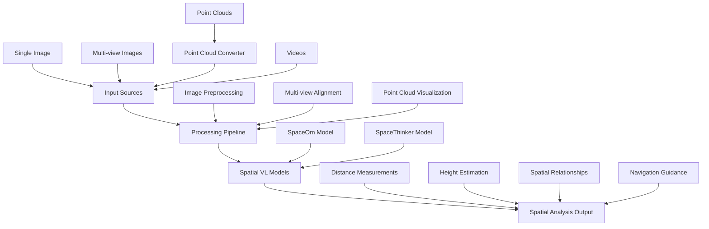

# Spatial Reasoning with VQASynth & Multi-Modal AI 🎯

A comprehensive guide to spatial reasoning capabilities for drone navigation and heterogeneous systems using SpaceOm, SpaceThinker, and VQASynth pipeline.

## Table of Contents
- [Overview](#overview)
- [System Architecture](#system-architecture)
- [Available Models](#available-models)
- [Input Capabilities](#input-capabilities)
- [Installation & Setup](#installation--setup)
- [Usage Examples](#usage-examples)
- [API Reference](#api-reference)
- [Applications](#applications)
- [Troubleshooting](#troubleshooting)

## Overview

This system provides advanced spatial reasoning capabilities for AI applications, particularly focused on:
- **Drone Navigation**: Multi-view obstacle detection, height estimation, path planning
- **Heterogeneous Systems**: Multi-sensor fusion, 3D scene understanding
- **Spatial VQA**: Question-answering about distances, sizes, and spatial relationships
- **3D Scene Analysis**: Point cloud processing and spatial reasoning

### Key Features
- 🎯 **Multi-Modal Input**: Images, multi-view images, point clouds, videos
- 🧠 **Advanced Reasoning**: Chain-of-thought spatial analysis with `<think>` and `<answer>` patterns
- 📐 **Accurate Measurements**: Precise distance and height estimation
- 🚁 **Drone-Optimized**: Navigation-specific spatial queries
- 🔧 **Extensible**: Easy integration with existing robotics pipelines

## System Architecture



## Available Models

### 1. SpaceOm 🌟
**Best overall spatial reasoning capabilities**
- **Path**: `./SpaceOm`
- **Specialization**: General spatial understanding and object relationships
- **Use Cases**: Object detection, scene understanding, general spatial queries
- **Performance**: Balanced accuracy across all spatial reasoning tasks

### 2. SpaceThinker 🎯
**Most accurate distance measurements with reasoning process**
- **Path**: `./SpaceThinker-Qwen2.5VL-3B`
- **Specialization**: Precise distance estimation with chain-of-thought reasoning
- **Use Cases**: Navigation planning, obstacle distance calculation, measurement tasks
- **Features**: Uses `<think>...</think>` and `<answer>...</answer>` tags for transparent reasoning
- **Performance**: Highest accuracy for distance and measurement queries

### Model Comparison

| Feature | SpaceOm | SpaceThinker |
|---------|---------|--------------|
| Distance Accuracy | ⭐⭐⭐⭐ | ⭐⭐⭐⭐⭐ |
| General Spatial Reasoning | ⭐⭐⭐⭐⭐ | ⭐⭐⭐⭐ |
| Reasoning Transparency | ⭐⭐⭐ | ⭐⭐⭐⭐⭐ |
| Speed | ⭐⭐⭐⭐ | ⭐⭐⭐ |
| Memory Usage | 7.5GB | 7.6GB |

## Input Capabilities

### ✅ Single Images
**Standard image analysis**
```python
# Supported formats: JPG, PNG, BMP, TIFF
question = "How tall is the building in meters?"
result = analyze_image("building.jpg", question)
```

### ✅ Multi-view Images
**Multiple camera angles for comprehensive spatial analysis**
```python
# For drone navigation with multiple cameras
images = ["front_view.jpg", "side_view.jpg", "top_view.jpg"]
question = "What's the clearance height for navigation?"
result = analyze_multiview(images, question)
```

**Use Cases:**
- Stereo vision analysis
- 360-degree scene understanding  
- Cross-view object tracking
- Multi-angle obstacle assessment

### ✅ Point Clouds (Converted)
**3D spatial data analysis through visualization**
```python
# Convert point cloud to multiple 2D projections
pcd_file = "scene.pcd"
question = "What's the height of the tallest object?"
result = analyze_pointcloud(pcd_file, question)
```

**Generated Views:**
- **3D Perspective**: Overall scene structure
- **Front View (X-Z)**: Elevation profile
- **Side View (Y-Z)**: Lateral profile  
- **Top View (X-Y)**: Floor plan/overhead

### ✅ Videos
**Temporal spatial analysis**
```python
# For dynamic scene understanding
video = "navigation_path.mp4"
question = "Track the moving obstacles in this sequence"
result = analyze_video(video, question)
```

## Installation & Setup

### Prerequisites
```bash
# System requirements
- Python 3.10+
- CUDA-capable GPU (24GB+ VRAM recommended)
- Ubuntu 20.04+ or similar Linux distribution

# Required packages
- PyTorch 2.0+
- Transformers 4.35+
- Gradio 4.0+
- Open3D (for point cloud processing)
- OpenCV (for video processing)
```

### Environment Setup
```bash
# 1. Create conda environment
conda create -n spatialvlm python=3.10
conda activate spatialvlm

# 2. Install core dependencies
pip install torch torchvision torchaudio --index-url https://download.pytorch.org/whl/cu118
pip install transformers>=4.35.0
pip install gradio
pip install open3d
pip install opencv-python
pip install matplotlib plotly pandas numpy

# 3. Install VQASynth (if creating new datasets)
cd /path/to/VQASynth-UAV
pip install -e .
```

### Model Download
```bash
# Models should be in your working directory:
# ./SpaceOm/
# ./SpaceThinker-Qwen2.5VL-3B/

# If not available locally, they'll be downloaded automatically from:
# - remyxai/SpaceOm
# - remyxai/SpaceThinker-Qwen2.5VL-3B
```

## Usage Examples

### 1. Quick Model Testing
```bash
# Test which models are working
python test_spatial_models.py
```
**Output:**
```
🎯 Testing Local Spatial Reasoning Models
✅ SpaceOm loaded successfully! (7.5GB GPU memory)
✅ SpaceThinker loaded successfully! (7.6GB GPU memory)
🚀 Ready to use spatial reasoning with 2 model(s)!
```

### 2. Interactive Spatial Reasoning
```bash
# Launch model selector interface
python spatial_model_selector.py
```
**Features:**
- Choose between SpaceOm and SpaceThinker
- Upload single or multiple images
- Ask spatial questions interactively
- Get real-time analysis

### 3. Simple Single-Image Analysis
```bash
# Basic spatial tester (uses first available model)
python simple_spatial_tester.py
```

### 4. Point Cloud Analysis
```bash
# Convert and analyze point clouds
python pointcloud_converter.py
```

### 5. VQASynth Dataset Creation
```bash
# Create new spatial reasoning datasets
bash run.sh
```

## API Reference

### Core Classes

#### `SpatialModelSelector`
Main class for managing multiple spatial reasoning models.

```python
from spatial_model_selector import SpatialModelSelector

selector = SpatialModelSelector()
selector.load_available_models()

# Single image analysis
result = selector.ask_spatial_question(
    images=[image],
    question="How tall is the object?",
    model_choice="SpaceThinker"
)
```

#### `SimpleSpatialTester`
Basic single-model interface.

```python
from simple_spatial_tester import SimpleSpatialTester

tester = SimpleSpatialTester()
tester.load_model()

result = tester.ask_spatial_question(
    image=image,
    question="What's the distance between objects?"
)
```

### Point Cloud Functions

#### `point_cloud_to_image()`
```python
from pointcloud_converter import point_cloud_to_image

views = point_cloud_to_image(
    pcd_path="scene.pcd",
    output_size=(512, 512),
    views=['3d', 'front', 'side', 'top']
)
```

#### `analyze_point_cloud_with_vlm()`
```python
from pointcloud_converter import analyze_point_cloud_with_vlm

result = analyze_point_cloud_with_vlm(
    pcd_path="scene.pcd",
    question="What's the clearance height?",
    spatial_model_func=selector.ask_spatial_question
)
```

## Applications

### 🚁 Drone Navigation

**Obstacle Detection:**
```python
question = "What obstacles are between 1-3 meters high that could interfere with drone flight?"
```

**Landing Zone Assessment:**
```python
question = "Is this area flat and clear enough for drone landing? What's the surface area?"
```

**Height Clearance:**
```python
question = "What's the minimum clearance height needed to fly over these obstacles?"
```

**Path Planning:**
```python
question = "What's the safest flight path between these obstacles?"
```

### 🤖 Heterogeneous Systems

**Multi-Sensor Fusion:**
```python
# Combine camera and LiDAR data
images = [camera_view, lidar_visualization]
question = "Correlate objects detected in both camera and LiDAR data"
```

**Collaborative Robotics:**
```python
question = "What's the workspace overlap between these two robotic arms?"
```

**Warehouse Automation:**
```python
question = "What's the optimal path for the robot to navigate around these boxes?"
```

### 📊 3D Scene Analysis

**Architecture/Construction:**
```python
question = "What are the dimensions of this room and the heights of different structural elements?"
```

**Autonomous Driving:**
```python
question = "What's the distance to the nearest vehicle and pedestrian?"
```

**Search and Rescue:**
```python
question = "Are there any human-shaped objects in this debris field?"
```

## Sample Questions by Category

### Distance & Measurement
- "How far apart are the two main objects?"
- "What's the distance from the camera to the building?"
- "Measure the gap between these obstacles"
- "How wide is the passage between objects?"

### Height & Elevation
- "How tall is the tallest structure?"
- "What's the height clearance under this bridge?"
- "Compare the heights of these objects"
- "What's the elevation difference across this terrain?"

### Spatial Relationships
- "Which object is closer to the camera?"
- "What's positioned to the left of the red building?"
- "Are these objects aligned or offset?"
- "Describe the relative positions of all visible objects"

### Navigation-Specific
- "Is there enough clearance for a 2-meter tall robot?"
- "What's the optimal path to avoid all obstacles?"
- "Which route has the most open space?"
- "Are there any overhead obstacles?"

### Size & Volume
- "Which object is larger in volume?"
- "What's the approximate surface area of this landing zone?"
- "Compare the sizes of these containers"
- "What's the storage capacity of this space?"

## Performance Optimization

### GPU Memory Management
```python
# For multiple models, load one at a time to save memory
selector.models = {}  # Clear unused models
torch.cuda.empty_cache()  # Free GPU memory
```

### Batch Processing
```python
# Process multiple images efficiently
questions = ["How tall?", "How wide?", "How far?"]
results = []
for q in questions:
    result = analyze_image(image, q)
    results.append(result)
```

### Point Cloud Optimization
```python
# Reduce point cloud density for faster processing
downsampled_pcd = pcd.voxel_down_sample(voxel_size=0.05)
```

## Integration Examples

### ROS Integration
```python
#!/usr/bin/env python3
import rospy
from sensor_msgs.msg import Image, PointCloud2
from cv_bridge import CvBridge
from spatial_model_selector import SpatialModelSelector

class SpatialReasoningNode:
    def __init__(self):
        self.selector = SpatialModelSelector()
        self.selector.load_available_models()
        self.bridge = CvBridge()
        
        # ROS subscribers
        rospy.Subscriber("/camera/image_raw", Image, self.image_callback)
        rospy.Subscriber("/velodyne_points", PointCloud2, self.pointcloud_callback)
        
    def image_callback(self, msg):
        cv_image = self.bridge.imgmsg_to_cv2(msg, "bgr8")
        result = self.selector.ask_spatial_question(
            [cv_image], 
            "What obstacles are within 5 meters?", 
            "SpaceThinker"
        )
        rospy.loginfo(f"Spatial analysis: {result}")
```

### OpenCV Integration
```python
import cv2
from spatial_model_selector import SpatialModelSelector

def process_video_stream():
    cap = cv2.VideoCapture(0)
    selector = SpatialModelSelector()
    selector.load_available_models()
    
    while True:
        ret, frame = cap.read()
        if not ret:
            break
            
        # Analyze every 30th frame
        if frame_count % 30 == 0:
            result = selector.ask_spatial_question(
                [frame], 
                "Any obstacles in the path?", 
                "SpaceOm"
            )
            print(f"Frame {frame_count}: {result}")
            
        cv2.imshow('Spatial Analysis', frame)
        if cv2.waitKey(1) & 0xFF == ord('q'):
            break
```

## Troubleshooting

### Common Issues

#### Model Loading Errors
```bash
# Error: "Unrecognized configuration class"
# Solution: Use correct model class
from transformers import Qwen2_5_VLForConditionalGeneration  # Note: underscore, not hyphen
```

#### GPU Memory Issues  
```bash
# Error: "CUDA out of memory"
# Solutions:
1. Reduce batch size
2. Use CPU mode: device_map="cpu"
3. Load one model at a time
4. Clear GPU cache: torch.cuda.empty_cache()
```

#### Point Cloud Processing
```bash
# Error: "Open3D not available"
# Solution: Install Open3D
pip install open3d

# Alternative: Manual PCD parsing (built-in fallback)
```

#### Model Type Mismatch
```bash
# Error: "qwen2_5_vl vs qwen2_vl type mismatch" 
# Solution: Ensure using Qwen2_5_VLForConditionalGeneration class
```

### Performance Issues

#### Slow Inference
- **Solution 1**: Use bfloat16 precision: `torch_dtype=torch.bfloat16`
- **Solution 2**: Enable Flash Attention: `attn_implementation="flash_attention_2"`
- **Solution 3**: Reduce image resolution before processing

#### High Memory Usage
- **Solution 1**: Process images sequentially instead of batch
- **Solution 2**: Use `low_cpu_mem_usage=True` when loading models
- **Solution 3**: Implement model swapping for multi-model setups

### Debug Commands

```bash
# Check GPU status
nvidia-smi

# Test model loading
python -c "from transformers import Qwen2_5_VLForConditionalGeneration; print('Model class available')"

# Verify CUDA availability
python -c "import torch; print(f'CUDA available: {torch.cuda.is_available()}')"

# Check available models
ls -la ./SpaceOm ./SpaceThinker-Qwen2.5VL-3B
```

## File Structure

```
VQASynth-UAV/
├── README.md                          # This documentation
├── spatial_model_selector.py          # Multi-model interface with selection
├── simple_spatial_tester.py          # Single-model basic interface  
├── test_spatial_models.py            # Model verification and testing
├── pointcloud_converter.py           # Point cloud to image conversion
├── spatial_reasoning_explorer.py     # Advanced exploration interface
├── transformer_inference.py          # Direct model inference example
├── VQASynth_Analysis_Notebook.ipynb  # Jupyter analysis notebook
├── SpaceOm/                          # SpaceOm model files
│   ├── config.json
│   ├── model-*.safetensors
│   └── ...
├── SpaceThinker-Qwen2.5VL-3B/       # SpaceThinker model files
│   ├── config.json
│   ├── model-*.safetensors  
│   └── ...
├── vqasynth/                         # VQASynth pipeline code
├── config/
│   └── config.yaml                   # Pipeline configuration
├── outputs/                          # Generated datasets
└── requirements.txt                  # Python dependencies
```

## Contributing

### Adding New Models
1. Add model path to `spatial_model_selector.py`
2. Update model configurations in `model_configs`
3. Test with `test_spatial_models.py`

### Custom Spatial Questions
1. Add to sample questions in interfaces
2. Create domain-specific question templates
3. Update documentation with examples

### New Input Modalities
1. Create converter functions (like `pointcloud_converter.py`)
2. Add to multi-modal interface
3. Update processing pipeline

## License & Citations

### VQASynth Citation
```bibtex
@article{chen2024spatialvlm,
  title = {SpatialVLM: Endowing Vision-Language Models with Spatial Reasoning Capabilities},
  author = {Chen, Boyuan and Xu, Zhuo and Kirmani, Sean and Ichter, Brian and Driess, Danny and Florence, Pete and Sadigh, Dorsa and Guibas, Leonidas and Xia, Fei},
  journal = {arXiv preprint arXiv:2401.12168},
  year = {2024},
  url = {https://arxiv.org/abs/2401.12168},
}
```

### VGGT Citation
```bibtex
@inproceedings{wang2025vggt,
  title={VGGT: Visual Geometry Grounded Transformer},
  author={Wang, Jianyuan and Chen, Minghao and Karaev, Nikita and Vedaldi, Andrea and Rupprecht, Christian and Novotny, David},
  booktitle={Proceedings of the IEEE/CVF Conference on Computer Vision and Pattern Recognition},
  year={2025}
}
```

## Support & Resources

- **GitHub Issues**: Report bugs and feature requests
- **Documentation**: This file and inline code comments
- **Examples**: See `examples/` directory for usage patterns
- **Community**: Join discussions about spatial reasoning in AI

---

**🎯 Ready to explore spatial reasoning? Start with `python test_spatial_models.py` to verify your setup!**